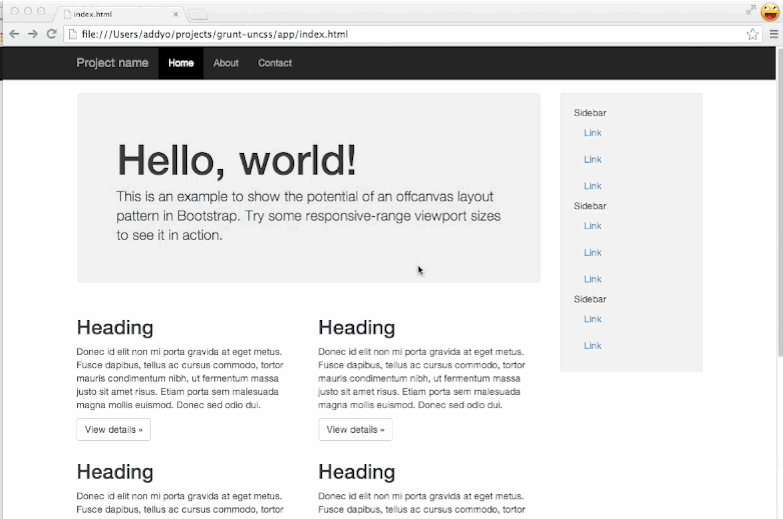
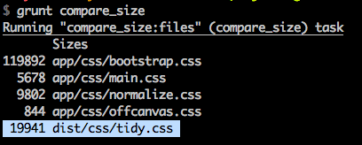

# grunt-uncss [](http://gruntjs.com/)

[](http://badge.fury.io/js/grunt-uncss)
[](https://travis-ci.org/addyosmani/grunt-uncss)
[](https://david-dm.org/addyosmani/grunt-uncss)
[](https://david-dm.org/addyosmani/grunt-uncss#info=devDependencies)

> 一个用于从项目中移除未使用的CSS的Grunt插件。可以跨多个文件工作，以及支持通过PhantomJS动态注入CSS。

## 预览

让一个使用Bootstrap的多页面项目的CSS从>120KB降到11KB。



## 入门

这个插件需要Grunt `~0.4.0`支持。

如果在此之前你还没用过[Grunt](http://gruntjs.com/)，务必先看以下[新手入门](http://gruntjs.com/getting-started)指南，它解释了如何创建一个[Gruntfile](http://gruntjs.com/sample-gruntfile)以及安装和使用Grunt插件。一旦你熟悉了这个过程，你可以使用这个命令来安装这个插件：

```shell
npm install grunt-uncss --save-dev
```
    
安装好这个插件只有，你还需要在Gruntfile中加入这行JavaScript来弃用这个插件。

```js
grunt.loadNpmTasks('grunt-uncss');
```

## Uncss任务

_要使用`grunt uncss`命令运行这个任务。_

任务目标，文件和选项可以按照[配置任务](http://gruntjs.com/configuring-tasks)指南来指定。

使用[uncss](https://github.com/giakki/uncss)时可以从项目中移除未使用的CSS。

### 用法

可以通过为你的干净的CSS文件指定一个目标（文件）来使用`grunt-uncss`任务。下面以`dist/css/tidy.css`为例。

> 意思就是指定一个目标文件，最后移除未使用的CSS之后生成的干净的文件就会放到指定的这个文件中。

在目标文件旁边，指定你想扫描使用了那些选择器的HTMl文件。下面以我项检查的`app/index.html`和`app/about.html`为例。

> 意思就是说，你要检查哪些html使用了哪些CSS，然后让生成的CSS只包含这些页面中使用到的CSS。

```js
uncss: {
  dist: {
    files: {
      'dist/css/tidy.css': ['app/index.html', 'app/about.html']
    }
  }
}
```
然后你就可以使用一个诸如`processhtml`的处理程序来重写你的样式表为`tidy.css`，使用一个像这样的块就行了：

> 意思就是用生成的文件，替换html中的旧样式引用

```html
<!-- build:css css/tidy.css -->
<link rel="stylesheet" href="css/normalize.css">
<link rel="stylesheet" href="css/main.css">
<link rel="stylesheet" href="css/bootstrap.css">
<!-- /build -->
```

一些其他的配置长这个样子：

```js
processhtml: {
  dist: {
    files: {
      'dist/index.html': ['app/index.html'],
      'dist/about.html': ['app/about.html']
    }
  }
}
```

## 选项(Options)

一个使用了所有支持的选项的示例：

```js
uncss: {
  dist: {
    options: {
      ignore       : ['#added_at_runtime', /test\-[0-9]+/],
      media        : ['(min-width: 700px) handheld and (orientation: landscape)'],
      csspath      : '../public/css/',
      raw          : 'h1 { color: green }',
      stylesheets  : ['lib/bootstrap/dist/css/bootstrap.css', 'src/public/css/main.css'],
      ignoreSheets : [/fonts.googleapis/],
      urls         : ['http://localhost:3000/mypage', '...'], // 已过时
      timeout      : 1000,
      htmlroot     : 'public',
      report       : 'min'
    },
    files: {
      'dist/css/tidy.css': ['app/index.html', 'app/about.html']
    }
  }
}
```

### 这些选项都做些什么?

- __ignore__ (Array - 数组): 提供一个不应该使用UnCSS移除的选择器列表。例如，添加给用户与页面交互的样式（`hover`，`click`），因为这些暂时不能让UnCSS探测到。可以使用字面量模式和正则表达式匹配模式。

- __media__ (Array - 数组): 默认情况下UnCSS值处理带"all", "screen"的媒体查询样式和那些没指定这些参数的。使用这个选项可以指定要包含进来的其他媒体查询标识。

- __csspath__ (String - 字符串): 相对于HTML文件的CSS的相对路径。默认情况下，UnCSS使用指定的`<link rel="stylesheet" href="path/to/file.css">`路径。

- __raw__ (String - 字符串): 给这个任务提供一个原生的CSS字符串，这个字符串会添加到现有的样式表选项中；当你的CSS还没写入磁盘时这个选项有利于让脚本使用。

- __stylesheets__ (Array - 数组): 使用这些指定的样式表，而不是从HTML文件中提取的那些。

- __ignoreSheets__ (Array - 数组):  不包含指定的样式表。

- __urls__ (Array - 数组): 使用Phantom加载的URL数组（on top of the files already passed if any）。

> 没用过，不了解括号里这句怎么翻译。

- __timeout__ (Number - 数字): 指定花多长时间等待JS先加载完成。

- __htmlroot__ (String - 字符串): 项目的根目录。比如你在本地文件上运行UnCSS时，有绝对路径形式的样式表，比如：`href="/css/style.css"`，这个选项就很有用啦。

- __report__ ('min'/'gzip'): 指定是否只打印出(输出)压缩结果或者报告压缩和gzip结果，但是这是在使用[maxmin](https://github.com/sindresorhus/maxmin)的情况下。

### 用例

```js
// 跨多个文件移除未使用的CSS
uncss: {
  dist: {
    files: {
      'dist/css/tidy.css': ['app/index.html', 'app/about.html']
    }
  }
}
```

```js
// 跨多个文件移除未使用的CSS，同时忽略指定的选择器
uncss: {
  dist: {
    files: {
      'dist/css/tidy.css': ['app/index.html', 'app/about.html']
      }
    },
    options: {
      ignore: ['#added_at_runtime', '.created_by_jQuery']
    }
  },
  options: {
    ignore: ['#added_at_runtime', '.created_by_jQuery']
  }
}
```


### 测试项目

在`test/app`目录下面包含了一个测试项目，你可以在使用`npm install`安装依赖之后通过运行`grunt`命令来构建它。它还包含了一个获取构建前后CSS尺寸信息的`grunt compare_size`任务：




## 问题

像[Bootstrap](http://getbootstrap.com), [TopCoat](http://topcoat.io) 等等这类用于界面库相当多，然而许多开发者都只会适应它们所提供的少于10%的CSS（大部分情况下，都不会完全使用到）。 其结果可想而知，它们会以生成大量冗余的样式而告终，这会显著增加页面的加载事件和影响心跟你过。

`grunt-uncss` 基于选择器检测，视图帮助大家生成只在项目中使用到的CSS。

## 一些研究结果和替代解决方案

过去，为视图解决未使用的CSS的问题已经付出了很多努力。Opera创建了[ucss](https://github.com/operasoftware/ucss)，@aandand创建了[https://github.com/aanand/deadweight](https://github.com/aanand/deadweight)，Brian Le Roux创建了[CSS Slap Chop](https://github.com/brianleroux/css-slap-chop)，还有一系列静心制作的客户端解决方案，比如[Helium-CSS](https://github.com/geuis/helium-css)，
[CSSESS](https://github.com/driverdan/cssess)以及基于Python的[mincss](http://www.peterbe.com/plog/mincss)。

不幸地是，大多数这些解决方案实际上并不会生成你真正想要的 - 精简构建出只包含你项目中用到的CSS规则。最近发现一个名为[uncss](https://github.com/giakki/uncss)的项目尝试解决这一问题，然后我就着手分享一些开发者们在这个领域需要解决的一些问题，然后构建了一个Grunt任务来让它用起来更容易。

非常感谢Giacomo Martino的为这一任务使用的Node模块提供的帮助。

## 相关报道

* [自动移除未使用的CSS - Velocity](http://www.youtube.com/watch?v=833xr1MyE30) - youtube上的视频，要翻墙
* [使用Grunt和UnCSS加速站点的加载事件](http://xdamman.com/website-optimization-grunt-uncss)
* [自动化前端工作流程(幻灯片)](https://speakerdeck.com/addyosmani/automating-front-end-workflow)
* [自动移除未使用的CSS - Windows](http://deanhume.com/Home/BlogPost/automatically-removing-unused-css-using-grunt/6101)

## 局限性(Limitations)

请注意`uncss`模块中使用的CSS解析器目前无法处理复杂的选择器。比如`[data-section=''] > section > [data-section-title] a`。这意味着在使用这个插件构建时可能会碰到诸如`TypeError: Cannot convert undefined or null to object`这样的异常。如果碰到这种情况，尽量考虑把这些复杂的选择器移到单独的文件中，然后不要用这个插件来检测它们。

我们也在积极的寻找和改善CSS解析器，一旦解决这一问题，我们会在这里发布公告。

## License

(C) Addy Osmani 2014, released under the MIT license